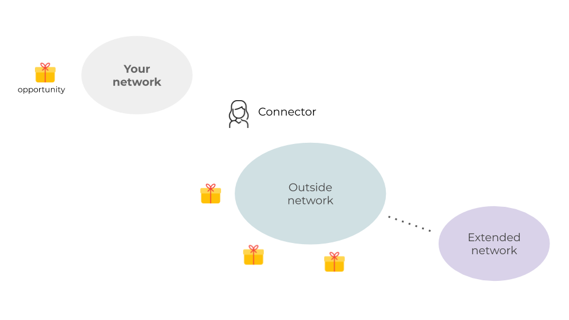

>TLDR;  “Connectors” are people who genuinely want to help others by connecting you to their network.

How did you get that remote job, or land that great freelance gig or an apartment in a highly competitive rental market?

Looking back at my career trajectory I can see two patterns emerging, great opportunities came by either pure luck or by tapping into a network outside of my immediate circle.

I want to talk about the latter, the "outsider" network effect. 

First,  let me share how I became a full-time remote developer in 2012.

Having lived in New York city for seven years, in the end I knew I was ready to move west to Oregon, literally speaking, to a greener place where I can live closer to the mountains.

I started my job search, also asking people I knew well if they knew of anything. 

Most of my friends were living and working in the city.  They had none to very few connections with companies out west.  Nothing.

One day during a water cooler chat, someone mentioned Maria had left for another company where she's now happily working full-time from home.

Maria and I were in the same department.  We were working on different projects under different managers .  Besides occasional small talks when we happened to share the elevator, there was little interaction between the two of us.  It's safe to say we had nothing in common.

Two weeks later I was able to get a hold of Maria via email, first to congratulate her on the new job, and also to inquire about the work-from-home part.  Lo and behold, I learned that her company was still hiring.  After several rounds of interviews, I got the job and joined a fully remote team. 

## The Connector
In his book “The Tipping Point”, Malcolm Gladwell calls people like Maria “connectors”.

Connectors are uniquely important people.  Due to their supportive nature they tend to have cultivated a large or diverse network.  And the key importance here is: they are willing to introduce us to their network.  According to Gladwell, people within our close circles are generally similar to us in terms of interests and social economic background.  Therefore, we are aware of similar opportunities.

For that reason, my groups of friends in New York while appearing to be diverse, in fact, had a lot in common with me.  We enjoyed going to similar restaurants, discussing the same TV series, and sharing similar hobbies on the weekend.

If they knew of a new opportunity, chances were it's going to be a position in tech in the city.

Connectors on the other hand are outside of our immediate circles.  There are little overlappings between their circles of friends and ours.  Connectors are exposed to potential opportunities that we and our friends are not aware of.

## Not All Networkings Are Equal

Have you met someone at a party and they said, “Oh, you should definitely talk to X!  I'll introduce you guys”.

When people offer to make an introduction, they see values in your ideas and are willing to take a reputation risk to connect you to their network, said Rob Fitzpatrick in his book for startup founders, [The Mom Test: How to Talk to Customers and Learn If Your Business is a Good Idea when Everyone is Lying to You.](http://momtestbook.com)

Connectors are not unicorns.  They can be a friend of a friend or someone in your extended network.   While you don't run into them very often, when you do, it's not too difficult to recognize one.  They are the conduit to new potentials and resources beyond what are currently available in our immediate network.

Last but not least, what is the best way to thank your connectors?  I think besides thanking them directly, one of the best ways is to pay it forward and become a connector yourself. 

