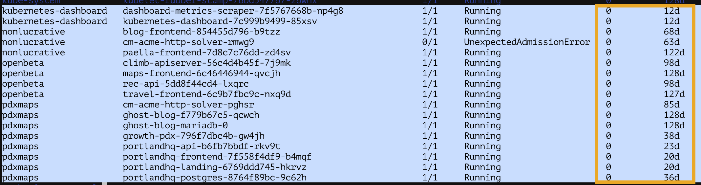

I used to work with Kubernetes and OpenShift at my previous corporate job.  

Installing and maintaining a realistic cluster, something more than just an all-in-one local dev cluster, has always been a headache because there are so many moving parts.  You could easily spend hours troubleshooting a dependency hell.

So far I'm pleased with my Kubernetes setup on Digital Ocean for the following reasons:

## One-click provisioning

A huge time-saver! In order to create a new cluster you will need to only make two imortant choices - number of compute notes and CPU/RAM for each node.

## They manage the master node for you

The master node is completely hidden from you nor you are billed for them.  

Pros:
- One less thing to worrt about
- You don't pay for extra CPU/RAM incurred by the master

Cons:
- Can't setup High-availablity/backup

I was wondering what their business decision behind this is.

## What about uptime?

Pod uptimes have been phenomenal.  I have pods that are 128 days old with 0 restarts.  

*The last two columns (in yellow box) are Restart counts and Age.*

## Conclusion

If you are comfortable with managing your own Kubernetes cluster, DigitalOcean is a great option for indie developers in terms of reliabilty and cost-benefit.

